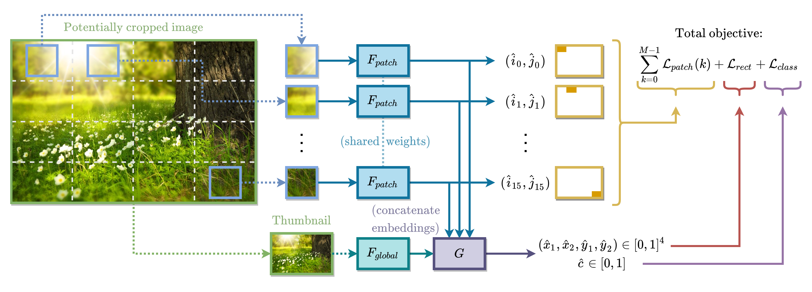

# Dissecting Image Crops

This is the official repository for B. Van Hoorick and C. Vondrick, "Dissecting Image Crops," *arXiv preprint arXiv:2011.11831*, 2020.
In short, we investigate what traces are left behind by visual cropping.

[Link to paper on ArXiv](https://arxiv.org/pdf/2011.11831.pdf)

## Very Minimal Usage Instructions

Step 1: Populate `data/train`, `data/val`, and `data/test` with high-resolution image files; a constant aspect ratio is strongly preferred.

Step 2: Run `python train.py`.

Step 3: Run `python test.py --model_path /path/to/above/checkpoint/folder`.

## Known Issues

There is a stubborn memory leak that builds up as you train over many epochs. I have tried many things but have no idea how to prevent it.

## BibTeX Citation

    @article{van2020dissecting,
        title={Dissecting Image Crops},
        author={Van Hoorick, Basile and Vondrick, Carl},
        journal={arXiv preprint arXiv:2011.11831},
        year={2020}
    }
